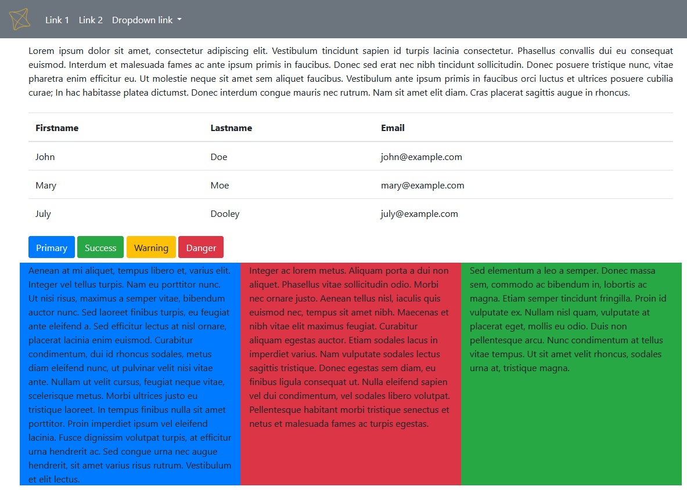
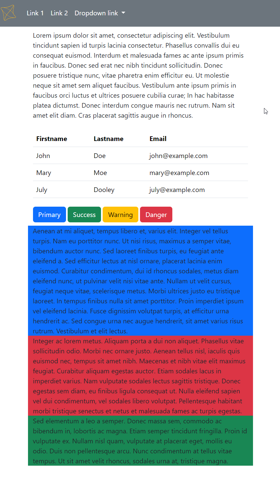

# VAII Cvičenie 03
Momentálne je otvorená branch __MAIN__, ktorá obsahuje _štartér_. Riešenie obsahuje branch  __SOLUTION__.

Toto cvičenie je zamerané na prácu s Bootstrap frameworkom a vytvorenie responzívneho dizajnu.

##  Postup práce

1. Pripojte si CSS a JS pre Bootstrap (CDN z https://getbootstrap.com/docs/5.3/getting-started/download/)
2. Zapnite *Code completion* pre CDN (Alt+Enter pri názve .css a .js súboru).
3. Vytvorte menu podľa obrázku.
4. Zmeňte farbu pozadia menu na sivú a položky menu na bielu farbu.
5. Pridajte logo do menu (obrázok `logo.png` sa nachádza v adresári images).
6. Prerobte menu tak, aby sa objavila ikona *hamburger* pri zmenšení veľkosti okna prehliadača pod určitú úroveň.
7. Vytvorte kontajner, riadok a stĺpec.
8. Vytvorte 4 bloky textu pomocou https://www.lipsum.com/, pričom každý bude mať inú farbu pozadia.
9. Usporiadajte ich tak, že jeden bude navrchu a tri pod ním vedľa seba.
10. Pomocou Bootstrap tried pridajte vnútornú medzerou (padding) a zarovnajte text do bloku.
11. Pridajte tabuľku do prvého bloku tak, aby bola responzívna. Pridajte do nej ďalšie tri stĺpce na otestovanie.
12. Pod tabuľkou vytvorte štyri tlačidlá vedľa seba.
13. Po kliknutí na jedno z tlačidiel (vyberte si, ktoré) otvorte modálne okno.
14. **Domáca úloha**: Skúste pridať medzeru medzi spodné 3 stĺpce.

Výsledné riešenie bude na počítači vyzerať nasledovne:

A na mobilnom zariadení:

## Ako nájsť branch môjho cvičenia?
Pokiaľ sa chcete dostať k riešeniu z cvičenia je potrebné otvoriť si príslušnú _branch_, ktorej názov sa skladá:

__MIESTNOST__ + "-" + __HODINA ZAČIATKU__ + "-" + __DEN__

Ak teda navštevujete cvičenie pondelok o 08:00 v RA323, tak sa branch bude volať: __RA323-08-PON__
