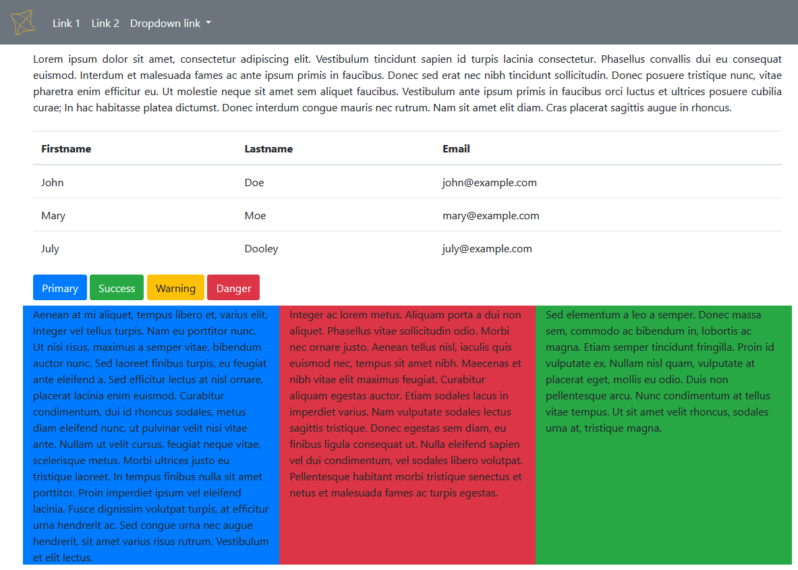
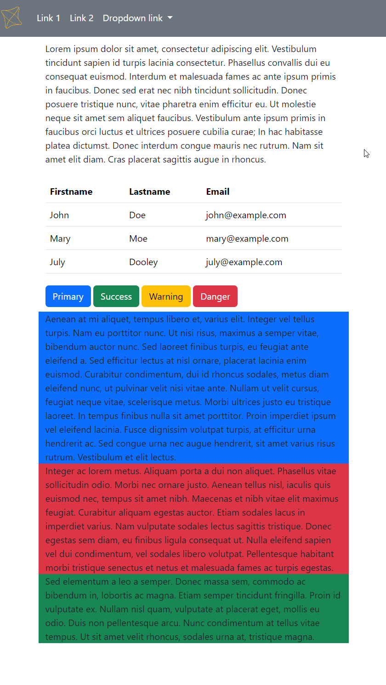

# VAII Cvičenie 03
Momentálne je otvorená branch __MAIN__, ktorá obsahuje _štartér_. Riešenie obsahuje branch  __SOLUTION__.

Toto cvičenie je zamerané na prácu s Bootstrap frameworkom a vytvorenie responzívneho dizajnu.

Úlohy vypracujte s pomocou AI agena. __POZOR__ ale všetko naraz v jednom prompt-e, ale krok po kroku. Vždy keď vám AI pre daný krok vygeneruje, skontrolujte navrhované úpravy a nezabudnite preskúmať, čo a prečo AI napísala alebo upravila.

# Úloha 01

Prvá úloha je zameraná na vytvorenie responzívneho menu a rozloženia stránky pomocou Bootstrap frameworku.

##  Postup práce

1. Pripojte si CSS a JS pre Bootstrap (CDN z https://getbootstrap.com/docs/5.3/getting-started/download/)
2. Zapnite *Code completion* pre CDN (Alt+Enter pri názve .css a .js súboru).
3. Vytvorte menu podľa obrázku.
4. Zmeňte farbu pozadia menu na sivú a položky menu na bielu farbu.
5. Pridajte logo do menu (obrázok `logo.png` sa nachádza v adresári images).
6. Prerobte menu tak, aby sa objavila ikona *hamburger* pri zmenšení veľkosti okna prehliadača pod určitú úroveň.
7. Vytvorte kontajner, riadok a stĺpec.
8. Vytvorte 4 bloky textu pomocou https://www.lipsum.com/, pričom každý bude mať inú farbu pozadia.
9. Usporiadajte ich tak, že jeden bude navrchu a tri pod ním vedľa seba.
10. Pomocou Bootstrap tried pridajte vnútornú medzerou (padding) a zarovnajte text do bloku.
11. Pridajte tabuľku do prvého bloku tak, aby bola responzívna. Pridajte do nej ďalšie tri stĺpce na otestovanie.
12. Pod tabuľkou vytvorte štyri tlačidlá vedľa seba.
13. Po kliknutí na jedno z tlačidiel (vyberte si, ktoré) otvorte modálne okno.
14. Skúste pridať medzeru medzi spodné 3 stĺpce.

Výsledné riešenie bude na počítači vyzerať nasledovne:

A na mobilnom zariadení:

# Úloha 02 

Druha úloha sa zameriava na modifikáciu existujúcej stránky pomocou Bootstrap frameworku. Jedná sa o layout veľmi populárnej stránky na predaj najlepšej obuvi akú ľudstvo ked vymyslelo - __KROKSY__.

## Postup práce

1. Upravte existujúci HTML kód tak, aby používal Bootstrap framework.
2. Upravte menu, tak aby bolo responzívne.
3. Upravte časť "Máme mobilnú appku", tak aby sa QR kód zobrazoval iba na desktope a pri zobrazení na mobil alebo tablete sa zobrazila ikonka presmerovania do google play alebo app store.
4. Časť "Upozorňujeme na" upravte tak, aby bola zobrazena na spôsob "carousel".
5. Naformátujte časť "Najpredávanejšie produkty"  a "Všetky topánočky" tak, aby sa produkty zobrazovali v riadkoch po 6 na desktop,  4 na tablete a 2 na mobile.
6. Časť "Najpredávanejšie produkty"  a "Všetky topánočky" vizuálne oddelte od zvyšku stránky inou farbou pozadia.
6. Pri produktoch sa zobrazuju poznamka o akcii alebo či sa jedna o novinku. Tieto informácie zobrazte pomocou "badge".
7. Nad sekciou "Všetky topánočky" vytvorte vizuál pre filter produktov podľa veľkosti, farby a ceny.
7. Upravte zobrazenie pagginácie na spodku stránky.
8. Skúste sa pohrať s dizajnom časti ""Vy a vaše papučky.
8. Urobte peknu patičku stránky.

## Ako nájsť branch môjho cvičenia?
Pokiaľ sa chcete dostať k riešeniu z cvičenia je potrebné otvoriť si príslušnú _branch_, ktorej názov sa skladá:

__MIESTNOST__ + "-" + __HODINA ZAČIATKU__ + "-" + __DEN__

Ak teda navštevujete cvičenie pondelok o 08:00 v RA323, tak sa branch bude volať: __RA323-08-PON__
